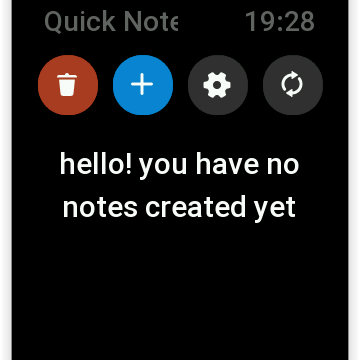
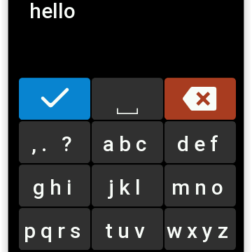
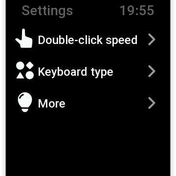
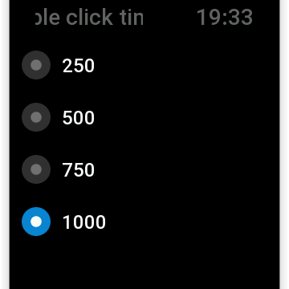
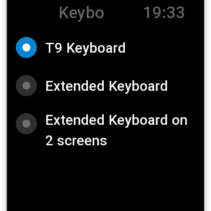
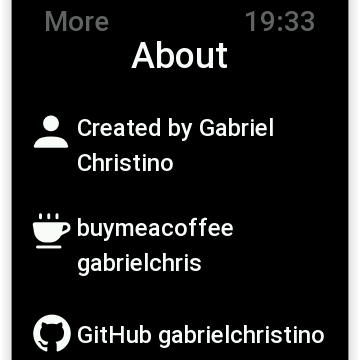
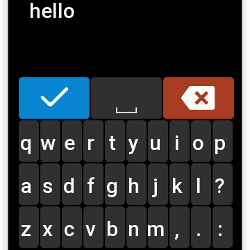
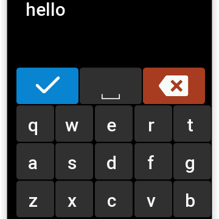
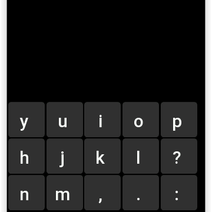

#  Quick notes

A mini app for Zepp OS 1.0 for create quick annotations directly on watch with a T9 keyboard.

## Quick start to a Quick note

When you open the app and no note is created, you'll see this page

 

To start, click on **create first note** button, you'll see a simple T9 keyboard. To write a note, tap n times a key until the letter you want appear.

**Tip**: The space is the third character in the first key ***,. ?*** or you can use the **␣** button.

**Tip**: Slide from the right to see numbers, more characters and emojis.

**Tip**: To backspace a wrong letter, click on the red button 

**Tip**: When you've finished, click on the blue button , and your note will be created.

 

On this screen, you can access the settings by clicking on the gear button 

Create a new note, clicking on the add button 

And delete all notes, clicking on the top trash button 

To delete a specific note, click on the respective trash button , at the right of the note.

Double-click a note to edit it.

 

## Settings

 

In the settings page you can set the double-click speed, change the keyboard type, read the Hints and About me :D
1. The double-click is the max time required to define if you're multi-clicking a button.

2. Now you have 3 types of keyboards:

    

    - **T9 Keyboard** : the first and classical one.

     

    

    - **Extended keyboard** : a QWERTY one to quick type any letter.

     

    
    

    - **Split keyboard**: a QWERTY one but in 2 screens for big letters, easy to see and type.

## The code

1. **page** directory you can view the screens of the project.

    - **nonotes.js** is the page when there is no note created.

    - **keyboard.js** is the page containing the keyboard, to created a new note.

    - **index.js** contains the notes list and some buttons.

    - **settings.js** the menu to the setting options.

    - **more.js** some hints and about me :D

    - **doubleclick.js** where you can change the double-click timeout.

    - **i18n** contains the translations to others languages, more will be added in the future.

2. **assets** there are all the icons and images used in the project.

3. **shared** the are the commons from ZeppOS, like Filesystem, Message builder, Logger and more.

4. **utils** I created some things to simplify the code, like Constants and UI components.

# Buy me a coffee

Help me to keep going!

https://www.buymeacoffee.com/gabrielchris